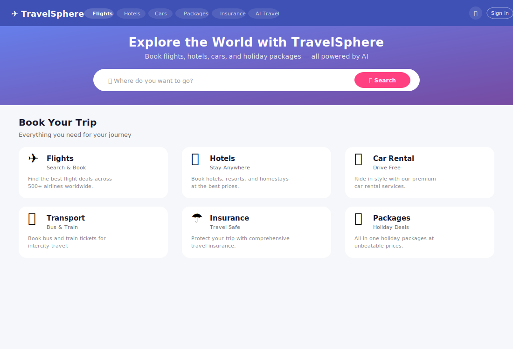
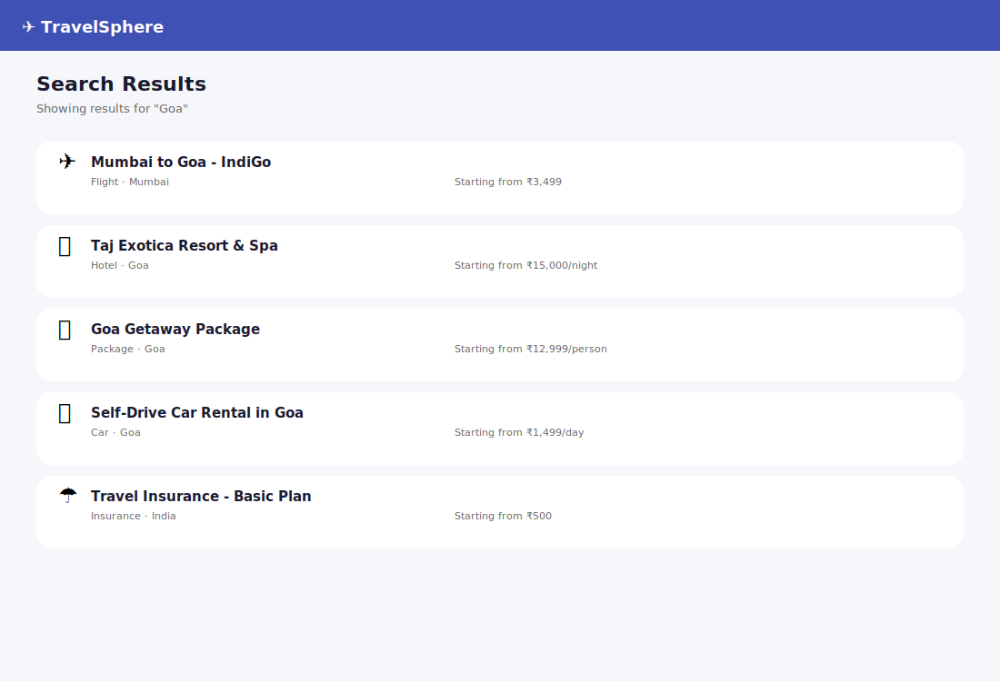
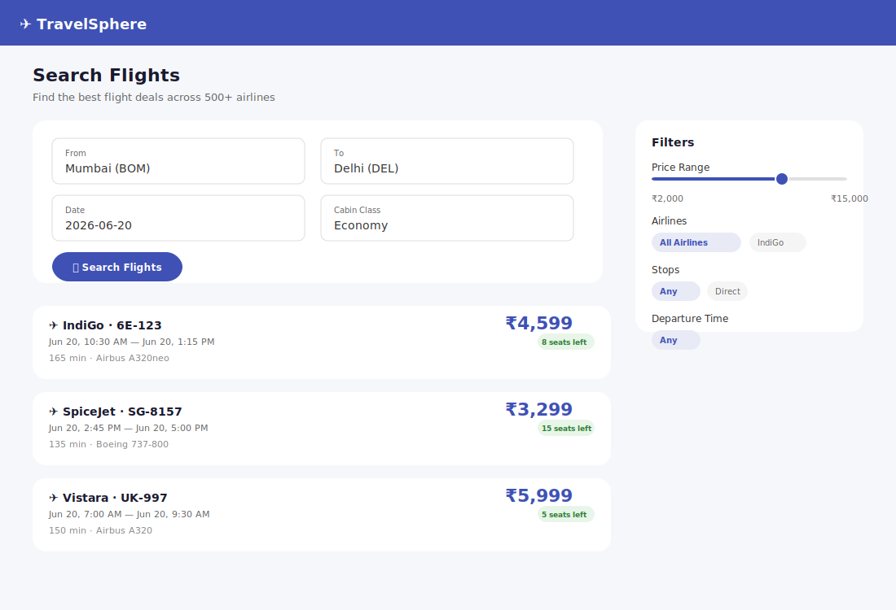
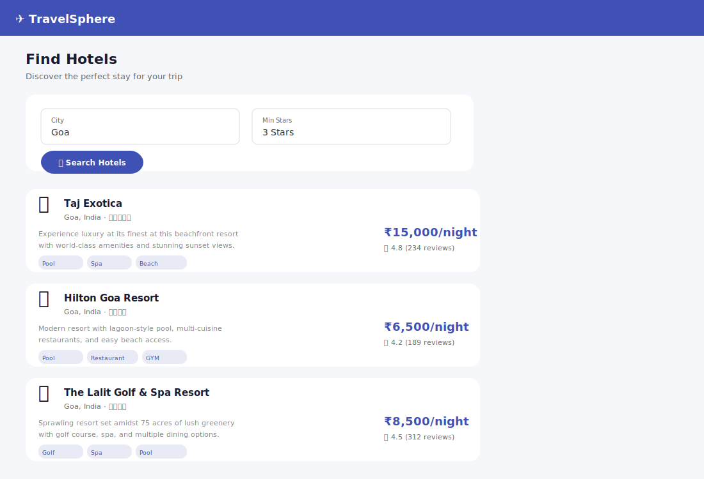
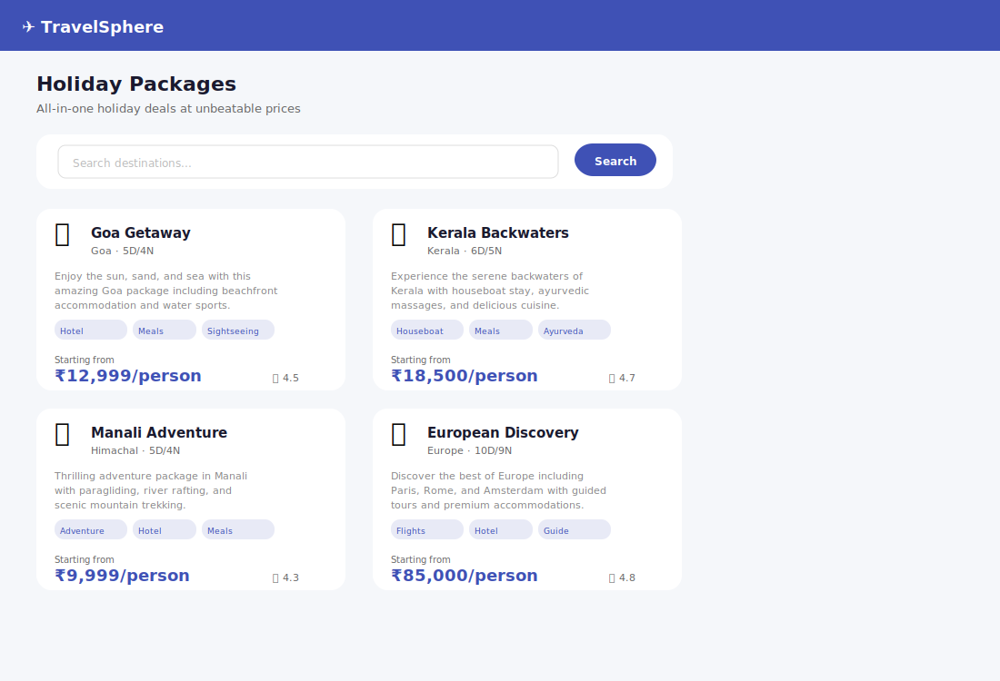
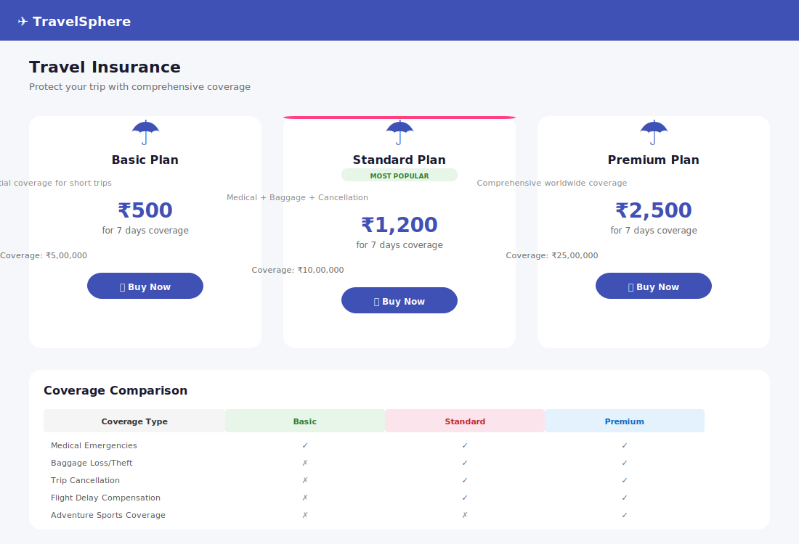
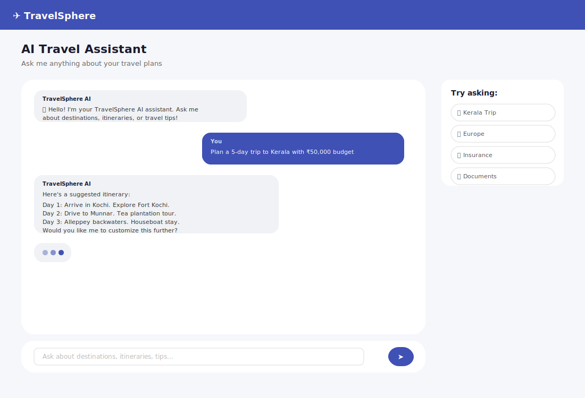
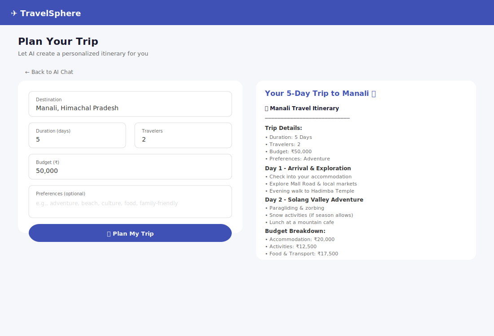
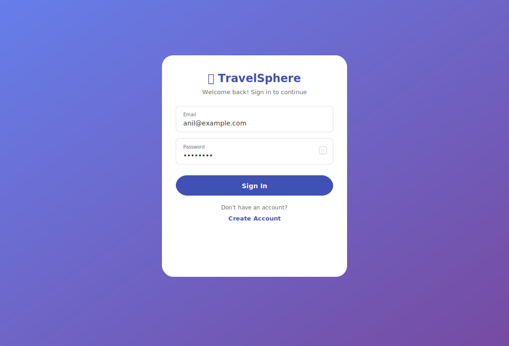
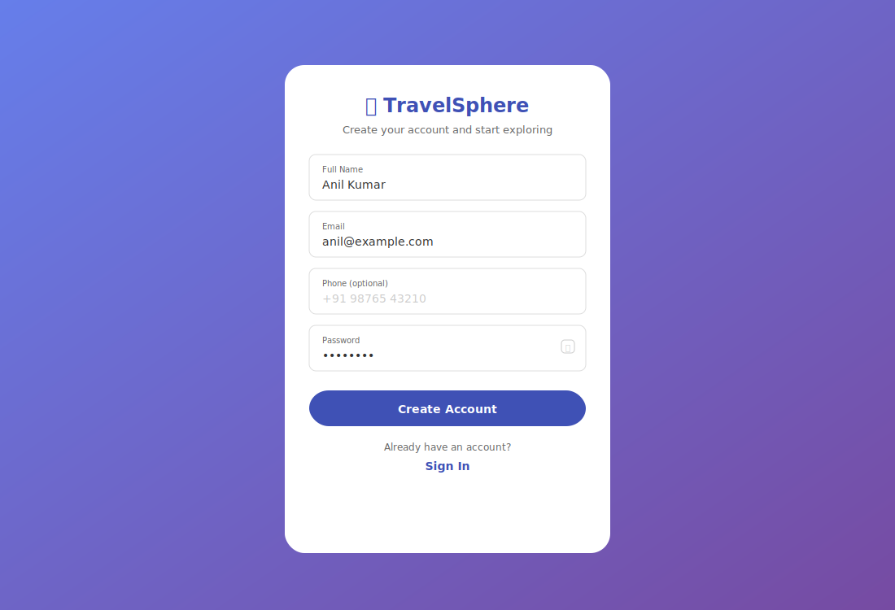

# 🌐 TravelSphere Nexus

**Enterprise AI-Powered Travel Booking & Insurance Platform** — 18 Java Spring Boot Microservices + Angular 17 PWA + Agentic AI (RAG + MCP + LangChain4j + Qdrant Vector DB)

[](https://github.com/Anilg1997/ai-travelsphere-platform)
[](https://openjdk.org/)
[](https://spring.io/projects/spring-boot)
[](https://angular.io/)
[](https://kafka.apache.org/)
[](https://docs.langchain4j.dev/)
[](https://qdrant.tech/)
[](https://modelcontextprotocol.io/)
[]()

---

## 📑 Table of Contents

1. [Project Overview](#-project-overview)
2. [System Architecture (HLD)](#-system-architecture-hld)
3. [Low-Level Design (LLD)](#-low-level-design-lld)
4. [RAG & AI Architecture](#-rag--ai-architecture)
5. [MCP (Model Context Protocol) Integration](#-mcp-model-context-protocol-integration)
6. [Tech Stack](#-tech-stack)
7. [Project Structure](#-project-structure)
8. [Screenshots](#-screenshots)
9. [Quick Start](#-quick-start)
10. [API Reference](#-api-reference)
11. [Deployment](#-deployment)

---

## 🏛 Project Overview

**TravelSphere Nexus** is an enterprise-grade, end-to-end travel booking and insurance platform built with a microservices architecture. It features:

- **18 Microservices** orchestrated via Spring Cloud (Eureka, Gateway, Config)
- **Agentic AI** powered by Ollama + LangChain4j RAG + MCP (Model Context Protocol)
- **Vector Database** (Qdrant) for semantic search over travel knowledge
- **Event-Driven Architecture** with 20+ Apache Kafka topics
- **Real-Time Streaming** via SSE for AI chat responses
- **PWA Frontend** with Angular 17 standalone components + NgRx state management
- **Enterprise Admin Panel** with real-time analytics, user/booking/content management, system health monitoring, and support ticketing
- **Complete Travel Services**: Flights, Hotels, Car Rentals, Transport, Insurance, Holiday Packages, Payments, Wallets, Loyalty, Referrals
- **Fraud Detection** system with configurable alerting
- **Audit Logging** across all services
- **Distributed Tracing** via Zipkin + Micrometer
- **Prometheus + Grafana** monitoring

---

## 🏗 System Architecture (HLD)

```
┌──────────────────────────────────────────────────────────────────────────────────────┐
│                               🌐 TravelSphere Nexus                                    │
├──────────────────────────────────────────────────────────────────────────────────────┤
│                                                                                        │
│  ┌──────────────────────────────────────────────────────────────────────────────┐    │
│  │                         🖥 Client Layer                                         │    │
│  │  ┌─────────────────────┐  ┌─────────────────────┐  ┌──────────────────────┐   │    │
│  │  │   Angular 17 PWA    │  │   Swagger UI        │  │   Mobile/3rd Party   │   │    │
│  │  │   (Port 4200)       │  │   (Port 8080)       │  │   API Consumers      │   │    │
│  │  └──────────┬──────────┘  └──────────┬──────────┘  └──────────┬───────────┘   │    │
│  └─────────────┼────────────────────────┼────────────────────────┼───────────────┘    │
│                │                        │                        │                     │
│  ┌─────────────▼────────────────────────▼────────────────────────▼───────────────┐    │
│  │                         🚪 API Gateway (Spring Cloud Gateway)                  │    │
│  │              Port 8080 · JWT Auth · Rate Limiting · Route Routing              │    │
│  │              Redis-backed rate limiter · CORS · Request/Response Logging       │    │
│  └───────────────────────────────────┬───────────────────────────────────────────┘    │
│                                      │                                                  │
│  ┌───────────────────────────────────▼───────────────────────────────────────────┐    │
│  │                         🏢 Service Discovery & Config                           │    │
│  │  ┌──────────────────────┐  ┌──────────────────────┐  ┌──────────────────────┐ │    │
│  │  │  Eureka Service      │  │  Spring Cloud Config │  │  Resilience4j        │ │    │
│  │  │  Registry (8761)     │  │  Server (8888)       │  │  Circuit Breakers    │ │    │
│  │  └──────────────────────┘  └──────────────────────┘  └──────────────────────┘ │    │
│  └──────────────────────────────────────────────────────────────────────────────┘    │
│                                      │                                                  │
│  ┌───────────────────────────────────▼───────────────────────────────────────────┐    │
│  │                         ⚙ Core Microservices (Domain)                           │    │
│  │                                                                                  │    │
│  │  ┌──────────┐ ┌──────────┐ ┌──────────┐ ┌──────────┐ ┌──────────┐ ┌──────────┐ │    │
│  │  │ Auth     │ │ User     │ │ Flight   │ │ Hotel    │ │Car Rental│ │Transport │ │    │
│  │  │ 8081     │ │ 8082     │ │ 8083     │ │ 8084     │ │ 8086     │ │ 8085     │ │    │
│  │  │ JWT+Redis│ │ Profile  │ │ Booking  │ │ Booking  │ │ Booking  │ │ Booking  │ │    │
│  │  └──────────┘ └──────────┘ └──────────┘ └──────────┘ └──────────┘ └──────────┘ │    │
│  │                                                                                  │    │
│  │  ┌──────────┐ ┌──────────┐ ┌──────────┐ ┌──────────┐ ┌──────────┐ ┌──────────┐ │    │
│  │  │Insurance │ │ Package  │ │ Payment  │ │Notification│ Document │ │ Search   │ │    │
│  │  │ 8087     │ │ 8088     │ │ 8089     │ │ 8091     │ │ 8092     │ │ 8093     │ │    │
│  │  │ Policies │ │ Holiday  │ │ Wallet   │ │ Email/SMS│ │ PDF Gen  │ │ Fulltext │ │    │
│  │  └──────────┘ └──────────┘ └──────────┘ └──────────┘ └──────────┘ └──────────┘ │    │
│  └──────────────────────────────────────────────────────────────────────────────┘    │
│                                      │                                                  │
│  ┌───────────────────────────────────▼───────────────────────────────────────────┐    │
│  │                         🤖 AI & Admin Layer                                      │    │
│  │                                                                                  │    │
│  │  ┌──────────────────────────────────────────┐  ┌────────────────────────────┐  │    │
│  │  │         AI Agent Service (8094)           │  │     Admin Service (8095)   │  │    │
│  │  │  ┌─────────┐ ┌─────────┐ ┌───────────┐  │  │  ┌─────────┐ ┌──────────┐  │  │    │
│  │  │  │Ollama   │ │LangChain│ │ MCP Server │  │  │  │Dashboard│ │ Fraud    │  │  │    │
│  │  │  │LLM      │ │4j RAG   │ │ Tools      │  │  │  │Analytics│ │ Detection│  │  │    │
│  │  │  └─────────┘ └────┬────┘ └───────────┘  │  │  └─────────┘ └──────────┘  │  │    │
│  │  │  ┌─────────┐ ┌────┴────┐                │  │  ┌─────────┐ ┌──────────┐  │  │    │
│  │  │  │Document │ │ Qdrant  │                │  │  │User Mgmt│ │Booking   │  │  │    │
│  │  │  │Ingestion│ │ Vector  │                │  │  │         │ │Mgmt      │  │  │    │
│  │  │  └─────────┘ │ Store   │                │  │  └─────────┘ └──────────┘  │  │    │
│  │  │              └─────────┘                │  │  ┌─────────┐ ┌──────────┐  │  │    │
│  │  └──────────────────────────────────────────┘  │  │Support  │ │System    │  │  │    │
│  │                                                 │  │Tickets  │ │Health    │  │  │    │
│  │                                                 │  └─────────┘ └──────────┘  │  │    │
│  │                                                 └────────────────────────────┘  │    │
│  └──────────────────────────────────────────────────────────────────────────────┘    │
│                                      │                                                  │
│  ┌───────────────────────────────────▼───────────────────────────────────────────┐    │
│  │                         📨 Message Broker (Event Bus)                           │    │
│  │  ╔═══════════════════════════════════════════════════════════════════════════╗  │    │
│  │  ║                    Apache Kafka 3.7 (20+ Topics)                          ║  │    │
│  │  ║  ts.flights.* │ ts.hotels.* │ ts.insurance.* │ ts.payments.* │ ts.ai.*   ║  │    │
│  │  ║  ts.users.* │ ts.notifications.* │ ts.admin.* │ ts.documents.*           ║  │    │
│  │  ╚═══════════════════════════════════════════════════════════════════════════╝  │    │
│  └──────────────────────────────────────────────────────────────────────────────┘    │
│                                      │                                                  │
│  ┌───────────────────────────────────▼───────────────────────────────────────────┐    │
│  │                         💾 Data Layer                                           │    │
│  │                                                                                  │    │
│  │  ┌──────────────────┐  ┌──────────────────┐  ┌──────────────────┐              │    │
│  │  │   PostgreSQL 16  │  │    Redis 7       │  │   Qdrant Vector  │              │    │
│  │  │   12 Schemas     │  │   Cache + Rate   │  │   DB (768-dim)   │              │    │
│  │  │   Schema-per-    │  │   Limiter +      │  │   Cosine Dist    │              │    │
│  │  │   Service        │  │   Session Store  │  │   Embeddings     │              │    │
│  │  └──────────────────┘  └──────────────────┘  └──────────────────┘              │    │
│  │                                                                                  │    │
│  │  ┌──────────────────┐  ┌──────────────────┐  ┌──────────────────┐              │    │
│  │  │   LocalStack S3  │  │   Flyway DB      │  │   Zipkin         │              │    │
│  │  │   Documents/     │  │   Migrations     │  │   Tracing        │              │    │
│  │  │   Photos Storage │  │   12 Schemas     │  │   Distributed    │              │    │
│  │  └──────────────────┘  └──────────────────┘  └──────────────────┘              │    │
│  └──────────────────────────────────────────────────────────────────────────────┘    │
│                                                                                        │
│  ┌──────────────────────────────────────────────────────────────────────────────┐    │
│  │                         📊 Monitoring & Observability                          │    │
│  │  ┌────────────┐ ┌────────────┐ ┌────────────┐ ┌────────────┐ ┌────────────┐  │    │
│  │  │ Prometheus │ │  Grafana   │ │  Kafka UI  │ │  MailHog   │ │  Swagger   │  │    │
│  │  │ Metrics    │ │ Dashboards │ │ Topic Mgmt │ │ Email View │ │ API Docs   │  │    │
│  │  └────────────┘ └────────────┘ └────────────┘ └────────────┘ └────────────┘  │    │
│  └──────────────────────────────────────────────────────────────────────────────┘    │
│                                                                                        │
└──────────────────────────────────────────────────────────────────────────────────────┘
```

---

## 📐 Low-Level Design (LLD)

### Service Communication Patterns

```
┌─────────────────────────────────────────────────────────────────────┐
│                    Communication Protocols                            │
├─────────────────────────────────────────────────────────────────────┤
│                                                                       │
│  🔄 Synchronous (REST/Feign):                                         │
│     API Gateway → All Services (via Eureka discovery)                 │
│     Admin Service → Flight/Hotel/Package (Feign Clients)             │
│                                                                       │
│  📨 Async (Kafka Events):                                             │
│     Booking Created → Payment Processed → Notification Sent           │
│     User Registered → Loyalty Updated → Welcome Email                 │
│     Payment Completed → Document Generated → Email Attachment         │
│     Fraud Detected → Admin Alerted → Account Flagged                  │
│                                                                       │
│  🖥 Real-Time (SSE):                                                   │
│     AI Chat → Streaming Response to Browser                          │
│     Notifications → Push to Connected Clients                         │
│                                                                       │
│  🔌 MCP (Model Context Protocol):                                     │
│     AI Agent → MCP Server Tools → Service Execution                   │
│     Tool: search_flights → Flight Service                             │
│     Tool: book_hotel → Hotel Service                                  │
│     Tool: get_insurance → Insurance Service                           │
│                                                                       │
└─────────────────────────────────────────────────────────────────────┘
```

### Database Schema Design (Schema-per-Service)

| Service | Schema | Key Tables |
|---------|--------|------------|
| Auth | `auth_schema` | `users`, `refresh_tokens`, `revoked_tokens` |
| User | `user_schema` | `user_profiles`, `referrals`, `loyalty_transactions` |
| Flight | `flight_schema` | `airports`, `flights`, `flight_bookings`, `seats` |
| Hotel | `hotel_schema` | `hotels`, `room_types`, `hotel_bookings`, `reviews` |
| Transport | `transport_schema` | `routes`, `transport_bookings` |
| Car Rental | `car_schema` | `vehicles`, `car_bookings` |
| Insurance | `insurance_schema` | `policy_types`, `policies`, `claims`, `claim_documents` |
| Package | `package_schema` | `packages`, `itineraries`, `package_bookings` |
| Payment | `payment_schema` | `payments`, `wallets`, `refunds`, `promo_codes` |
| Notification | `notification_schema` | `notifications`, `templates` |
| Document | `document_schema` | `documents` |
| Search/AI | `search_schema` | `search_index`, `chat_sessions`, `chat_messages` |
| Admin | `admin_schema` | `fraud_alerts`, `audit_logs`, `support_tickets`, `booking_records`, `system_metrics` |

### Kafka Event Flow

```
┌────────────┐     ts.flights.booked     ┌─────────────┐     ts.payments.processed     ┌──────────────┐
│  Flight     │─────────────────────────►│   Payment    │──────────────────────────────►│  Document     │
│  Service    │                          │   Service    │                               │  Service      │
└────────────┘                          └─────────────┘                               └──────────────┘
       │                                       │                                              │
       │                                       │                                              │
       ▼                                       ▼                                              ▼
┌────────────┐     ts.notifications.send  ┌─────────────┐     ts.documents.generated   ┌──────────────┐
│ Notification│◄──────────────────────────│   Any        │◄─────────────────────────────│  Email/SMS    │
│ Service     │                          │   Service    │                               │  Notification │
└────────────┘                          └─────────────┘                               └──────────────┘
```

### Security Architecture

```
┌──────────────┐     ┌──────────────┐     ┌──────────────┐     ┌──────────────┐
│  Client      │────►│  API Gateway │────►│  Auth Service│────►│  Redis Token │
│  (JWT Store) │     │  Validate    │     │  (8081)      │     │  Blacklist   │
└──────────────┘     │  Token       │     │  Verify JWT  │     └──────────────┘
                     └──────────────┘     │  BCrypt 12   │
                                          └──────────────┘
                                               │
                                               ▼
                                          ┌──────────────┐
                                          │  PostgreSQL  │
                                          │  auth_schema │
                                          └──────────────┘
```

---

## 🧠 RAG & AI Architecture

```
┌──────────────────────────────────────────────────────────────────────────────┐
│                       🤖 TravelSphere AI Agent (Port 8094)                     │
│                                                                                │
│  ┌────────────────────────────────────────────────────────────────────────┐   │
│  │                          User Query                                      │   │
│  └───────────────────────────┬────────────────────────────────────────────┘   │
│                              │                                                  │
│                              ▼                                                  │
│  ┌────────────────────────────────────────────────────────────────────────┐   │
│  │                      Query Router                                        │   │
│  │  ┌─────────────────┐  ┌─────────────────┐  ┌────────────────────────┐  │   │
│  │  │  Direct Chat     │  │  RAG-Enhanced    │  │  MCP Tool Execution   │  │   │
│  │  │  /api/v1/ai/chat │  │  /api/v1/ai/rag- │  │  /api/v1/ai/mcp/      │  │   │
│  │  │                  │  │  chat            │  │  execute              │  │   │
│  │  └────────┬─────────┘  └────────┬─────────┘  └───────────┬────────────┘  │   │
│  └───────────┼────────────────────┼────────────────────────┼───────────────┘   │
│              │                    │                        │                    │
│              ▼                    ▼                        ▼                    │
│  ┌──────────────────┐  ┌────────────────────┐  ┌────────────────────────┐    │
│  │  Ollama LLM       │  │  RAG Pipeline      │  │  MCP Server            │    │
│  │  llama3.2         │  │                    │  │                        │    │
│  │  Temperature: 0.7 │  │  ┌──────────────┐  │  │  ┌──────────────────┐  │    │
│  │  Max Tokens: 2048 │  │  │ User Query   │  │  │  │ search_flights   │  │    │
│  └────────┬─────────┘  │  └──────┬───────┘  │  │  ├──────────────────┤  │    │
│           │             │         │          │  │  │ search_hotels    │  │    │
│           │             │         ▼          │  │  ├──────────────────┤  │    │
│           │             │  ┌──────────────┐  │  │  │ create_booking   │  │    │
│           │             │  │ Embed Query  │  │  │  ├──────────────────┤  │    │
│           │             │  │ (nomic-embed-│  │  │  │ cancel_booking   │  │    │
│           │             │  │  text)       │  │  │  ├──────────────────┤  │    │
│           │             │  └──────┬───────┘  │  │  │ get_insurance    │  │    │
│           │             │         │          │  │  ├──────────────────┤  │    │
│           │             │         ▼          │  │  │ get_weather      │  │    │
│           │             │  ┌──────────────┐  │  │  ├──────────────────┤  │    │
│           │             │  │ Qdrant Vector│  │  │  │ currency_convert │  │    │
│           │             │  │ Store (768d) │  │  │  ├──────────────────┤  │    │
│           │             │  │ Cosine Dist  │  │  │  │ get_destination  │  │    │
│           │             │  │ Top-K: 5     │  │  │  ├──────────────────┤  │    │
│           │             │  │ Min-Score:0.7│  │  │  │ get_travel_adv   │  │    │
│           │             │  └──────┬───────┘  │  │  └──────────────────┘  │    │
│           │             │         │          │  └────────────────────────┘    │
│           │             │         ▼          │                               │
│           │             │  ┌──────────────┐  │                               │
│           │             │  │ Build Context│  │                               │
│           │             │  │ + Prompt     │  │                               │
│           │             │  └──────┬───────┘  │                               │
│           │             │         │          │                               │
│           │             └─────────┼──────────┘                               │
│           │                       │                                           │
│           └───────────────────────┼───────────────────────────────────────────┘
│                                   │
│                                   ▼
│                    ┌──────────────────────────┐
│                    │  Ollama Generate Response │
│                    │  (Circuit Breaker Wrapped)│
│                    └──────────────────────────┘
│                                   │
│                                   ▼
│                    ┌──────────────────────────┐
│                    │  Response to Client       │
│                    │  (Stored in PostgreSQL)   │
│                    └──────────────────────────┘
│                                                                                │
│  ┌────────────────────────────────────────────────────────────────────────┐   │
│  │                        Document Ingestion Pipeline                       │   │
│  │                                                                          │   │
│  │  Source → Text → Document Splitter → Embed → Store in Qdrant            │   │
│  │             (Recursive, chunk=500, overlap=50)                           │   │
│  └────────────────────────────────────────────────────────────────────────┘   │
│                                                                                │
└──────────────────────────────────────────────────────────────────────────────┘
```

### RAG Pipeline Details

```
User Query: "Plan a trip to Goa"
       │
       ▼
┌───────────────────┐
│ 1. Embed Query    │───► nomic-embed-text → 768-dim vector
└───────────────────┘
       │
       ▼
┌───────────────────┐
│ 2. Vector Search  │───► Qdrant: Cosine Similarity, Top-K=5, Min Score=0.7
└───────────────────┘
       │
       ▼
┌───────────────────┐
│ 3. Build Context  │───► Retrieved chunks → Formatted context string
└───────────────────┘
       │
       ▼
┌───────────────────┐
│ 4. Augment Prompt │───► "Context: {travel knowledge}\n\nUser: {query}"
└───────────────────┘
       │
       ▼
┌───────────────────┐
│ 5. LLM Generate   │───► Ollama llama3.2 → Enhanced response with RAG
└───────────────────┘
```

---

## 🔌 MCP (Model Context Protocol) Integration

TravelSphere implements the **Model Context Protocol (MCP)** to provide AI agents with structured tools for performing real-world actions.

### MCP Architecture

```
┌─────────────────────────────────────────────────────────────────────────────┐
│                              MCP Architecture                                 │
│                                                                               │
│  ┌──────────────┐     ┌──────────────────┐     ┌──────────────────────────┐ │
│  │  AI Agent     │────►│  MCP Server       │────►│  TravelSphere Services  │ │
│  │  (Ollama)     │     │  (Tool Registry)  │     │  (REST Feign Clients)   │ │
│  └──────────────┘     └──────────────────┘     └──────────────────────────┘ │
│                              │                                                  │
│                              ▼                                                  │
│                       ┌──────────────────┐                                     │
│                       │  Tool Definitions │                                     │
│                       │  ┌────────────────┴─────────────────┐                  │ │
│                       │  │ search_flights(t)   create_booking│                  │ │
│                       │  │ search_hotels(t)    cancel_booking│                  │ │
│                       │  │ get_weather(t)      file_claim(t) │                  │ │
│                       │  │ get_destination(t)  get_insurance │                  │ │
│                       │  │ currency_convert(t) get_travel_adv│                  │ │
│                       │  └──────────────────────────────────┘                  │ │
│                       └──────────────────────────────────────────────────────────┘
└─────────────────────────────────────────────────────────────────────────────┘
```

### Available MCP Tools

| Tool | Description | Parameters | Response |
|------|-------------|------------|----------|
| `search_flights` | Search available flights | from, to, date, passengers | flight list with prices |
| `search_hotels` | Search hotels by city | city, check_in, check_out, guests, stars | hotel list with rates |
| `create_booking` | Create a booking | service_type, service_id, user_id, date | booking reference |
| `cancel_booking` | Cancel existing booking | booking_ref, reason | cancellation status |
| `get_insurance_plans` | Get insurance plans | destination, duration, age | plan options with premiums |
| `file_insurance_claim` | File an insurance claim | policy_id, claim_type, description, amount | claim reference |
| `get_destination_info` | Get destination info | destination | attractions, tips, best time |
| `get_weather` | Get weather forecast | destination, date | temperature, conditions |
| `currency_converter` | Convert currencies | from, to, amount | converted amount, rate |
| `get_travel_advisory` | Get safety info | destination | advisory level, tips |

---

## 🛠 Tech Stack

| Layer | Technology | Version |
|-------|-----------|---------|
| **Language** | Java | 17 (LTS) |
| **Backend Framework** | Spring Boot | 3.3.0 |
| **Cloud** | Spring Cloud | 2023.0.3 |
| **Service Discovery** | Netflix Eureka | Spring Cloud |
| **API Gateway** | Spring Cloud Gateway | Spring Cloud |
| **Config Management** | Spring Cloud Config | Spring Cloud |
| **Security** | Spring Security 6 + JWT (HS512) + BCrypt (12 rounds) | jjwt 0.12.5 |
| **Database** | PostgreSQL 16 (schema-per-service, 12 schemas) | 16-alpine |
| **Caching** | Redis 7 | 7-alpine |
| **Vector DB** | Qdrant (768-dim, Cosine distance) | latest |
| **ORM** | Spring Data JPA + Hibernate | - |
| **DB Migrations** | Flyway | - |
| **Messaging** | Apache Kafka 3.7 (20+ topics) | Confluent 7.6.0 |
| **AI/LLM** | Ollama (llama3.2 + nomic-embed-text) | latest |
| **RAG Framework** | LangChain4j + Qdrant | 0.35.0 |
| **MCP** | Model Context Protocol (Custom Server) | 1.0.0 |
| **Spring AI** | Spring AI | 1.0.0-M6 |
| **Frontend** | Angular 17+ (standalone, PWA) | ^17.3.0 |
| **UI Library** | Angular Material | ^17.3.0 |
| **State Management** | NgRx (Store, Effects, ComponentStore) | ^17.2.0 |
| **PDF Generation** | iText7 | 7.2.5 |
| **AWS SDK** | AWS SDK v2 (S3) | 2.25.68 |
| **LocalStack** | LocalStack (S3, Lambda, SQS, SNS, SES) | latest |
| **API Docs** | SpringDoc OpenAPI (Swagger UI) | 2.5.0 |
| **Circuit Breaker** | Resilience4j (Feign + WebClient) | 3.1.2 |
| **HTTP Client** | OpenFeign (with fallback factories) | 4.1.3 |
| **Tracing** | Micrometer + Brave + Zipkin | 1.3.3 |
| **Monitoring** | Prometheus + Grafana | latest |
| **Container** | Docker / Docker Compose | - |
| **CI/CD** | GitHub Actions (Build → Test → Docker → Deploy) | - |
| **Container Registry** | ghcr.io | - |
| **Infrastructure** | AWS EC2 (t2.micro) + RDS PostgreSQL (db.t3.micro) | Free Tier |
| **Build Tool** | Maven | 3.9+ |

---

## 📁 Project Structure

```
travelsphere-nexus/
├── backend/                          # 18 Java Spring Boot Microservices
│   ├── service-registry/            # Netflix Eureka (port 8761)
│   ├── config-server/               # Spring Cloud Config (port 8888)
│   ├── api-gateway/                 # Spring Cloud Gateway (port 8080)
│   ├── auth-service/                # JWT auth (port 8081)
│   ├── user-service/                # User profiles (port 8082)
│   ├── flight-service/              # Flight booking (port 8083)
│   ├── hotel-service/               # Hotel booking (port 8084)
│   ├── transport-service/           # Bus/train (port 8085)
│   ├── car-rental-service/          # Car rental (port 8086)
│   ├── insurance-service/           # Insurance (port 8087)
│   ├── package-service/             # Holiday packages (port 8088)
│   ├── payment-service/             # Payments (port 8089)
│   ├── notification-service/        # Email/SMS (port 8091)
│   ├── document-service/            # PDF generation (port 8092)
│   ├── search-service/              # Full-text search (port 8093)
│   ├── ai-agent-service/            # AI agent (port 8094)
│   ├── admin-service/               # Admin panel (port 8095)
│   └── common-lib/                  # Shared library (DTOs, Feign clients)
├── frontend/
│   └── travelsphere-ui/             # Angular 17 PWA app
│       ├── src/
│       │   ├── app/
│       │   │   ├── components/      # Header, Footer, NotificationPanel
│       │   │   ├── guards/          # Auth guard
│       │   │   ├── interceptors/    # Auth, Error interceptors
│       │   │   ├── models/          # 11 TypeScript model files
│       │   │   ├── services/        # 12 Angular services
│       │   │   └── pages/           # 30+ page components
│       │   └── environments/        # Dev/Prod env config
│       └── package.json
├── config-repo/                      # Spring Cloud Config (18 YAML files)
├── infra/                            # Infrastructure configs
│   ├── postgres/init.sql            # 12 schemas
│   ├── kafka/KafkaTopicConfig.java  # 20+ topics
│   ├── qdrant/QdrantInitializer.java # Vector collection
│   ├── localstack/LocalStackInitializer.java # S3 buckets
│   ├── prometheus.yml               # Scrape config
│   └── aws/user-data.sh             # EC2 bootstrap
├── screenshots/                      # UI preview images
├── .env.example                      # 62 env variables
├── docker-compose.yml                # 23 services orchestration
└── pom.xml                           # Root Maven POM (18 modules)
```

### Frontend Routes (30+ Pages)

| Route | Page | Auth | Description |
|-------|------|:----:|-------------|
| `/home` | Home | - | Hero, service cards, stats, AI CTA |
| `/search` | Global Search | - | Cross-service search |
| `/login` | Login | - | JWT authentication |
| `/register` | Register | - | User registration |
| `/flights` | Flight Search | - | Search & filter flights |
| `/flights/:id` | Flight Detail | - | Flight information |
| `/flights/:id/book` | Flight Booking | ✅ | Booking form |
| `/hotels` | Hotel Search | - | Search & filter hotels |
| `/hotels/:id/book` | Hotel Booking | ✅ | Room booking |
| `/cars` | Car Search | - | Vehicle search |
| `/cars/:id/book` | Car Booking | ✅ | Vehicle booking |
| `/transport` | Transport | - | Bus/train search |
| `/insurance` | Insurance List | - | Policy types |
| `/insurance/claims` | Insurance Claims | ✅ | File & track claims |
| `/packages` | Packages | - | Holiday packages |
| `/payments` | Payment Init | ✅ | Payment processing |
| `/wallet` | Wallet | ✅ | Balance & top-up |
| `/ai/chat` | AI Chat | - | AI travel assistant |
| `/ai/rag-chat` | RAG Chat | - | AI with knowledge base |
| `/ai/plan-trip` | Trip Planner | - | AI itinerary generator |
| `/profile` | Profile | ✅ | User profile |
| `/bookings` | My Bookings | ✅ | Booking history |
| `/loyalty` | Loyalty | ✅ | Points & tiers |
| `/referrals` | Referrals | ✅ | Referral program |
| `/notifications` | Notifications | ✅ | Notification center |
| `/documents` | Documents | ✅ | Download PDFs |
| `/admin` | Admin Dashboard | ✅ | Platform analytics |
| `/admin/users` | User Mgmt | ✅ | CRUD users |
| `/admin/bookings` | Booking Mgmt | ✅ | Manage bookings |
| `/admin/analytics` | Analytics | ✅ | Revenue, users, bookings |
| `/admin/fraud-alerts` | Fraud Alerts | ✅ | Fraud detection |
| `/admin/tickets` | Support | ✅ | Ticket management |
| `/admin/system-health` | System Health | ✅ | Service monitoring |

---

## 📸 Screenshots

### 🏠 Home & Search

| Page | Preview |
|------|---------|
| **Home** — Hero with gradient background, global search, service cards, AI CTA |  |
| **Search Results** — Global search across flights, hotels, packages, cars, insurance |  |

### ✈️ Travel Services

| Page | Preview |
|------|---------|
| **Flight Search** — Search form with filters, results with pricing & seats |  |
| **Hotel Search** — Hotel cards with star ratings, amenities, pricing, and reviews |  |
| **Holiday Packages** — Package listing with duration, pricing, ratings, and inclusions |  |
| **Travel Insurance** — Policy comparison with coverage table, premium calculator |  |

### 🤖 AI Features

| Page | Preview |
|------|---------|
| **AI Chat** — Chat interface with travel assistant, suggestions, and message history |  |
| **Trip Planner** — AI-powered itinerary generator with form and structured output |  |

### 🔐 Authentication

| Page | Preview |
|------|---------|
| **Login** — Gradient background, glassmorphism card, social login |  |
| **Register** — Sign-up form with validation and gradient design |  |

---

## 🚀 Quick Start

### Prerequisites

| Tool | Version | Purpose |
|------|---------|---------|
| Docker | 24+ | Container orchestration |
| Docker Compose | v2 | Multi-service orchestration |
| Java | 17+ (Temurin JDK) | Backend runtime |
| Maven | 3.9+ | Build tool |
| Node.js | 20+ | Angular frontend |
| Ollama | latest | Local LLM for AI features |

### Step 1: Configure Environment

```bash
cp .env.example .env
```

### Step 2: Start Infrastructure

```bash
docker compose up -d postgres redis kafka zookeeper qdrant localstack zipkin prometheus grafana kafka-ui mailhog
```

### Step 3: Pull Ollama Models

```bash
ollama pull llama3.2
ollama pull nomic-embed-text
```

### Step 4: Build All Services

```bash
# Ensure JAVA_HOME points to JDK 17+
mvn clean package -DskipTests
```

### Step 5: Start Core Services

```bash
docker compose up -d service-registry config-server
sleep 30
docker compose up -d api-gateway auth-service user-service
```

### Step 6: Start Domain Services

```bash
docker compose up -d flight-service hotel-service transport-service car-rental-service insurance-service package-service payment-service
```

### Step 7: Start Support & AI Services

```bash
docker compose up -d notification-service document-service search-service admin-service ai-agent-service
```

### Step 8: Start Angular Frontend

```bash
cd frontend/travelsphere-ui
npm ci
npx ng serve
```

### Step 9: Access the Platform

| Service | URL |
|---------|-----|
| Angular UI | http://localhost:4200 |
| API Gateway | http://localhost:8080 |
| Swagger UI | http://localhost:8080/swagger-ui.html |
| Eureka Dashboard | http://localhost:8761 |
| Kafka UI | http://localhost:8090 |
| Zipkin Tracing | http://localhost:9411 |
| Grafana (admin/admin) | http://localhost:3000 |
| Qdrant Dashboard | http://localhost:6333/dashboard |
| MailHog SMTP UI | http://localhost:8025 |

---

## 📡 API Reference

All endpoints return the standard `ApiResponse` wrapper:

```json
{
  "success": true,
  "data": {},
  "error": null,
  "message": "Operation successful",
  "timestamp": "2024-01-15T10:30:00Z",
  "requestId": "uuid"
}
```

### Auth API (`/api/v1/auth`)
- `POST /register` — Register new user
- `POST /login` — Login, returns JWT tokens
- `POST /refresh` — Refresh access token
- `POST /logout` — Revoke tokens
- `GET /me` — Current user info

### Flight API (`/api/v1/flights`)
- `GET /search` — Search flights
- `GET /{id}` — Flight details
- `POST /book` — Book a flight
- `PUT /cancel/{ref}` — Cancel booking
- `POST /check-in/{ref}` — Check in

### Insurance API (`/api/v1/insurance`)
- `GET /policies` — List policy types
- `POST /calculate` — Calculate premium
- `POST /purchase` — Purchase policy
- `POST /claims` — File a claim
- `GET /claims/{id}` — Claim status

### Payment API (`/api/v1/payments`)
- `POST /initiate` — Initiate payment
- `POST /confirm` — Confirm payment
- `GET /wallet/balance` — Wallet balance
- `POST /wallet/topup` — Add funds

### AI Agent API (`/api/v1/ai`)

#### Chat & Planning
- `POST /chat` — Chat with AI assistant
- `POST /rag-chat` — Chat with RAG-enhanced AI
- `POST /plan-trip` — AI trip planning with RAG
- `GET /recommendations` — Personalized recommendations
- `POST /insurance-advisor` — Insurance recommendations

#### MCP Tools
- `POST /mcp/execute` — Execute an MCP tool
- `GET /mcp/tools` — List all available tools
- `GET /mcp/stats` — Tool call statistics

#### RAG & Knowledge
- `POST /ingest` — Ingest document into vector DB
- `POST /ingest/batch` — Batch ingest documents
- `POST /semantic-search` — Semantic search across knowledge base

### Admin API (`/api/v1/admin`)

#### Dashboard & Analytics
- `GET /dashboard` — Platform dashboard summary
- `GET /analytics?period=7d` — Detailed analytics

#### User Management
- `GET /users` — List all users
- `GET /users/{userId}` — User details
- `PUT /users/{userId}/status?enabled=true` — Enable/disable user
- `PUT /users/{userId}/role?role=ADMIN` — Update user role

#### Booking Management
- `GET /bookings` — List all bookings
- `GET /bookings/{bookingRef}` — Booking details
- `POST /bookings/{bookingRef}/cancel` — Cancel booking
- `POST /bookings/{bookingRef}/refund` — Process refund

#### Content Management
- `POST /content` — Manage platform content

#### Support Tickets
- `GET /tickets` — List support tickets
- `POST /tickets` — Create ticket
- `PUT /tickets/{id}` — Update ticket
- `POST /tickets/{id}/assign?adminUserId=X` — Assign ticket
- `POST /tickets/{id}/resolve?resolution=X` — Resolve ticket

#### Fraud Detection
- `GET /fraud-alerts` — Get fraud alerts
- `PUT /fraud-alerts/{id}` — Update alert status

#### System Monitoring
- `GET /system/health` — System health status
- `GET /system/metrics` — System metrics

### AI Agent Examples

```bash
# Chat with TravelSphere AI
curl -X POST http://localhost:8080/api/v1/ai/chat \
  -H "Authorization: Bearer <token>" \
  -H "Content-Type: application/json" \
  -d '{"message": "Plan a 7-day trip to Goa under ₹50,000 for 2 people"}'

# RAG-Enhanced Chat
curl -X POST http://localhost:8080/api/v1/ai/rag-chat \
  -H "Authorization: Bearer <token>" \
  -H "Content-Type: application/json" \
  -d '{"message": "What are the best beaches in Goa?"}'

# Execute MCP Tool
curl -X POST http://localhost:8080/api/v1/ai/mcp/execute \
  -H "Authorization: Bearer <token>" \
  -H "Content-Type: application/json" \
  -d '{"toolName": "search_flights", "parameters": {"from": "BOM", "to": "DEL", "date": "2026-07-15"}}'

# List Available MCP Tools
curl http://localhost:8080/api/v1/ai/mcp/tools

# Ingest Document into Knowledge Base
curl -X POST http://localhost:8080/api/v1/ai/ingest \
  -H "Authorization: Bearer <token>" \
  -H "Content-Type: application/json" \
  -d '{"content": "Goa is known for its beautiful beaches...", "source": "goa-travel-guide", "contentType": "travel-guide"}'

# Semantic Search
curl -X POST http://localhost:8080/api/v1/ai/semantic-search \
  -H "Authorization: Bearer <token>" \
  -H "Content-Type: application/json" \
  -d '{"query": "best beaches in Goa", "topK": 5}'

# Get Insurance Recommendations
curl -X POST http://localhost:8080/api/v1/ai/insurance-advisor \
  -H "Authorization: Bearer <token>" \
  -d 'destination=Switzerland&duration=10&age=32'
```

---

## ☁ Deployment

### AWS Architecture

```
┌───────────────────────────────────────────────────────────────┐
│                      AWS Cloud                                  │
│                                                                 │
│  ┌─────────────────────────┐  ┌─────────────────────────────┐  │
│  │  EC2 t2.micro           │  │  RDS PostgreSQL db.t3.micro │  │
│  │  - Docker Compose       │  │  - 12 Schemas               │  │
│  │  - All 18 Microservices │  │  - Automated Backups         │  │
│  │  - Angular PWA          │  │  - Multi-AZ (prod)          │  │
│  │  - Prometheus + Grafana │  └─────────────────────────────┘  │
│  └─────────────────────────┘                                    │
│                                                                 │
│  ┌─────────────────────────┐  ┌─────────────────────────────┐  │
│  │  S3 Buckets             │  │  GitHub Actions              │  │
│  │  - travelsphere-docs    │  │  - CI: Build + Test + Docker │  │
│  │  - travelsphere-photos  │  │  - CD: SSH Deploy to EC2    │  │
│  └─────────────────────────┘  └─────────────────────────────┘  │
└───────────────────────────────────────────────────────────────┘
```

### CI/CD Pipeline

```yaml
# GitHub Actions Workflow
on: push to main
  ↓
Matrix Build (17 services in parallel)
  ↓
Unit Tests (JUnit 5 + Mockito)
  ↓
Integration Tests (Testcontainers)
  ↓
Docker Build & Push to ghcr.io
  ↓
SSH Deploy to AWS EC2
  ↓
Health Check & Rollback on Failure
```

### GitHub Secrets Required

- `AWS_ACCESS_KEY_ID`, `AWS_SECRET_ACCESS_KEY`, `AWS_REGION`
- `EC2_HOST`, `EC2_USERNAME`, `EC2_SSH_KEY`
- `DOCKER_USERNAME`, `DOCKER_PASSWORD` (for ghcr.io)

---

## 📊 Kafka Topics

| Topic | Partitions | Producer | Consumers |
|-------|:---------:|----------|-----------|
| `ts.flights.booked` | 3 | Flight Service | Payment, Notification |
| `ts.flights.cancelled` | 3 | Flight Service | Payment (refund), Notification |
| `ts.flights.checked-in` | 3 | Flight Service | Notification |
| `ts.hotels.booked` | 3 | Hotel Service | Payment, Notification |
| `ts.hotels.cancelled` | 3 | Hotel Service | Payment, Notification |
| `ts.transport.booked` | 3 | Transport Service | Payment, Notification |
| `ts.cars.booked` | 3 | Car Rental Service | Payment, Notification |
| `ts.insurance.policy-issued` | 3 | Insurance Service | Document, Notification |
| `ts.insurance.claim-filed` | 3 | Insurance Service | Admin, Notification |
| `ts.insurance.claim-resolved` | 3 | Insurance Service | Notification |
| `ts.packages.booked` | 3 | Package Service | Payment, Notification |
| `ts.payments.processed` | 3 | Payment Service | Document, Notification |
| `ts.payments.failed` | 3 | Payment Service | Notification |
| `ts.payments.refunded` | 3 | Payment Service | Notification, Admin |
| `ts.users.registered` | 3 | Auth Service | User, Loyalty, Notification |
| `ts.users.loyalty-updated` | 3 | User Service | Notification |
| `ts.documents.generated` | 3 | Document Service | Notification |
| `ts.search.indexed` | 3 | Search Service | - |
| `ts.ai.query-logged` | 3 | AI Agent Service | Admin, Analytics |
| `ts.ai.document-ingested` | 3 | AI Agent Service | Admin |
| `ts.notifications.send` | 3 | Any Service | Notification Service |
| `ts.admin.fraud-alert` | 3 | Any Service | Admin Service |
| `ts.admin.content-updated` | 3 | Admin Service | AI Agent (re-index) |
| `ts.admin.audit-log` | 3 | Admin Service | - |

---

## 📜 License

**Proprietary** — TravelSphere Nexus Platform

© 2026 TravelSphere. All rights reserved.

---

*Built with ❤️ by the TravelSphere Engineering Team*
